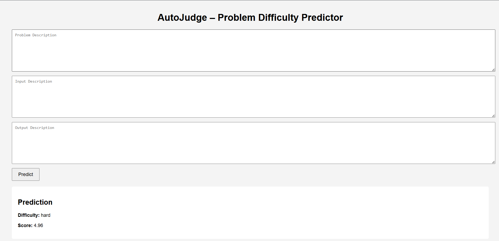

#  AutoJudge – Problem Difficulty Prediction System

## 📖 Overview
**AutoJudge** is a machine learning system that predicts the **difficulty level** (Easy / Medium / Hard) and a **numerical difficulty score** of programming problems using their textual descriptions.  
The project combines **Natural Language Processing (NLP)**, **classification**, **regression**, and a **web-based interface** for real-time predictions.  

---

## 🗂 Dataset
The dataset consists of programming problems with the following fields:  
- **Problem Description**  
- **Input Description**  
- **Output Description**  
- **Difficulty Class** (Easy / Medium / Hard)  
- **Difficulty Score** (numerical)  

---

## 🛠 Approach

### 1️⃣ Data Preprocessing
- Combined multiple text fields:
  - Problem Description  
  - Input Description  
  - Output Description  
- Cleaned text by:
  - Removing line breaks & extra spaces  
  - Converting text to lowercase  
  - Removing stopwords  
  - Tokenization & lemmatization  
- Encoded target labels using **Label Encoding**  
- Standardized numerical features for regression  

### 2️⃣ Feature Engineering
- **TF-IDF Vectorization** to convert text into numerical features  
- Considered **unigrams** and **bigrams** to capture context  
- Limited feature size to **5000 features** to reduce sparsity  

### 3️⃣ Models Used

#### 🔹 Classification (Problem Difficulty)
- Logistic Regression (baseline)  
- XGBoost Classifier  
- Random Forest Classifier  

#### 🔹 Regression (Difficulty Score)
- Linear Regression  
- Random Forest Regressor  
- Gradient Boosting Regressor  

---

## 📊 Model Performance Comparison

### Classification Models
| Model | Accuracy | Precision (Macro Avg) | Recall (Macro Avg) | F1-Score (Macro Avg) |
|-------|---------|---------------------|------------------|--------------------|
| Logistic Regression | 0.538 | 0.52 | 0.46 | 0.48 |
| XGBoost Classifier | 0.539 | 0.50 | 0.46 | 0.47 |
| Random Forest | 0.549 | 0.52 | 0.42 | 0.40 |

**✅ Selected Model:** **XGBoost Classifier**  
**Reason:**  
- Handles **high-dimensional sparse TF-IDF features** better than logistic regression  
- Captures **non-linear relationships**  
- Provides **better recall** and overall balance between classes  

---

### Regression Models
| Model | R² Score | MAE | RMSE |
|-------|----------|-----|------|
| Linear Regression | -2.356 | 3.213 | 4.014 |
| Random Forest Regressor | 0.136 | 1.693 | 2.037 |
| Gradient Boosting Regressor | 0.154 | 1.676 | 2.016 |

**✅ Selected Model:** **Gradient Boosting Regressor**  
**Reason:**  
- Lowest **MAE and RMSE** among all models  
- Captures **non-linear relationships** effectively  
- Most reliable for predicting numerical difficulty scores  

---

## 🌐 Web Interface
- Built using **Flask + HTML + CSS**  
- Users can input:
  - Problem Description  
  - Input Description  
  - Output Description  
- The system outputs:
  - **Predicted Difficulty Class** (Easy / Medium / Hard)  
  - **Predicted Difficulty Score**
 
### Screenshot


---


## ⚙️ Setup Instructions (Run Locally)

## Project Structure

```
Submission/
│
├── app.py
├── requirements.txt
│
├── models/
│   ├── difficulty_classifier.pkl
│   ├── difficulty_regressor.pkl
│   └── label_encoder.pkl
│
├── templates/
│   └── index.html
│
├── static/
│   └── style.css
│
└── screenshots/
    └── web_interface.png

```
1. Clone the reopsitory 
```bash
git clone https://github.com/Aditibharadwaj/AutoJudge.git
cd AutoJudge
```
2. Install dependencies
```bash
pip install -r requirements.txt
```
3. Run the Flask application
```bash
python app.py
```
4. Open in the browser
```cpp
http://127.0.0.1:5000
```

--- 

👤 Personal Info

Name: Aditi B R  
Enrollment Number: 23113009  
Email: aditi_br@ce.iitr.ac.in
